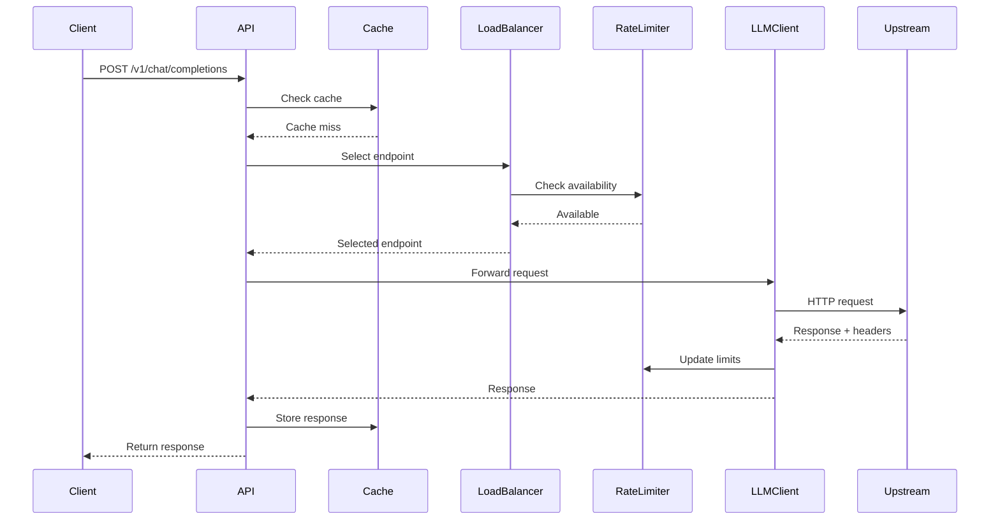

# LLMProxy Technical Design Document

## Core Component Designs

### 1. Load Balancer Design

The load balancer uses a weighted round-robin algorithm with endpoint health tracking.

```python
# managers/load_balancer.py

from typing import List, Optional, Dict
from datetime import datetime, timedelta
import random
import asyncio
from models.endpoint import Endpoint, EndpointStatus

class LoadBalancer:
    def __init__(self, cooldown_time: int = 60):
        self.cooldown_time = cooldown_time
        self.endpoint_pools: Dict[str, List[Endpoint]] = {}
        self._lock = asyncio.Lock()
    
    async def select_endpoint(self, model_group: str) -> Optional[Endpoint]:
        """Select an endpoint using weighted round-robin with health checks"""
        async with self._lock:
            pool = self.endpoint_pools.get(model_group, [])
            
            # Filter available endpoints
            available = [ep for ep in pool if await self._is_available(ep)]
            
            if not available:
                # All endpoints are down, try weight=0 fallbacks
                fallbacks = [ep for ep in pool if ep.weight == 0]
                available = [ep for ep in fallbacks if await self._is_available(ep)]
            
            if not available:
                return None
            
            # Weighted random selection
            total_weight = sum(ep.weight for ep in available)
            if total_weight == 0:
                return random.choice(available)
            
            rand = random.uniform(0, total_weight)
            cumulative = 0
            
            for endpoint in available:
                cumulative += endpoint.weight
                if rand <= cumulative:
                    return endpoint
            
            return available[-1]
    
    async def _is_available(self, endpoint: Endpoint) -> bool:
        """Check if endpoint is available for requests"""
        if endpoint.status == EndpointStatus.HEALTHY:
            return True
        
        if endpoint.status == EndpointStatus.COOLING_DOWN:
            if datetime.utcnow() > endpoint.cooldown_until:
                endpoint.status = EndpointStatus.HEALTHY
                endpoint.consecutive_failures = 0
                return True
        
        return False
```

### 2. Rate Limit Manager Design

Track and respect rate limits using Redis for persistence.

```python
# managers/rate_limit_manager.py

import asyncio
from datetime import datetime, timedelta
from typing import Dict, Optional, Tuple
import redis.asyncio as redis
import json

class RateLimitManager:
    def __init__(self, redis_client: redis.Redis):
        self.redis = redis_client
        self._local_cache: Dict[str, dict] = {}
        self._lock = asyncio.Lock()
    
    async def check_availability(self, endpoint_id: str) -> Tuple[bool, Optional[int]]:
        """Check if endpoint has available capacity
        Returns: (is_available, seconds_until_reset)
        """
        key = f"ratelimit:{endpoint_id}"
        
        # Get rate limit info from Redis
        data = await self.redis.get(key)
        if not data:
            return True, None
        
        limit_info = json.loads(data)
        
        # Check token bucket
        tokens = limit_info.get('tokens', 0)
        reset_at = datetime.fromisoformat(limit_info.get('reset_at'))
        
        if datetime.utcnow() >= reset_at:
            # Reset period has passed
            return True, None
        
        if tokens > 0:
            return True, None
        
        # Calculate wait time
        wait_seconds = int((reset_at - datetime.utcnow()).total_seconds())
        return False, wait_seconds
    
    async def update_from_headers(self, endpoint_id: str, headers: dict):
        """Update rate limit info from response headers"""
        # Parse OpenAI rate limit headers
        remaining = headers.get('x-ratelimit-remaining-requests')
        limit = headers.get('x-ratelimit-limit-requests')
        reset = headers.get('x-ratelimit-reset-requests')
        
        if not all([remaining, limit, reset]):
            return
        
        # Update Redis
        key = f"ratelimit:{endpoint_id}"
        data = {
            'tokens': int(remaining),
            'limit': int(limit),
            'reset_at': reset,
            'updated_at': datetime.utcnow().isoformat()
        }
        
        await self.redis.setex(
            key, 
            3600,  # 1 hour TTL
            json.dumps(data)
        )
```

### 3. Cache Manager Design

Intelligent caching with request fingerprinting.

```python
# core/cache_manager.py

import hashlib
import json
from typing import Optional, Any
import redis.asyncio as redis
from datetime import timedelta

class CacheManager:
    def __init__(self, redis_client: redis.Redis, ttl: int = 604800, namespace: str = "llmproxy"):
        self.redis = redis_client
        self.ttl = ttl
        self.namespace = namespace
    
    def _generate_cache_key(self, request_data: dict) -> str:
        """Generate cache key from request parameters"""
        # Extract relevant fields for caching
        cache_data = {
            'model': request_data.get('model'),
            'messages': request_data.get('messages'),
            'temperature': request_data.get('temperature', 1.0),
            'max_tokens': request_data.get('max_tokens'),
            'top_p': request_data.get('top_p', 1.0),
            'frequency_penalty': request_data.get('frequency_penalty', 0),
            'presence_penalty': request_data.get('presence_penalty', 0),
            'tools': request_data.get('tools'),
            'tool_choice': request_data.get('tool_choice'),
        }
        
        # Create deterministic hash
        cache_str = json.dumps(cache_data, sort_keys=True)
        cache_hash = hashlib.sha256(cache_str.encode()).hexdigest()
        
        return f"{self.namespace}:{cache_hash}"
    
    async def get(self, request_data: dict) -> Optional[dict]:
        """Get cached response"""
        # Don't cache streaming requests
        if request_data.get('stream', False):
            return None
        
        key = self._generate_cache_key(request_data)
        data = await self.redis.get(key)
        
        if data:
            return json.loads(data)
        return None
    
    async def set(self, request_data: dict, response_data: dict):
        """Cache response"""
        # Don't cache streaming responses or errors
        if request_data.get('stream', False) or 'error' in response_data:
            return
        
        key = self._generate_cache_key(request_data)
        await self.redis.setex(
            key,
            self.ttl,
            json.dumps(response_data)
        )
```

### 4. LLM Client Wrapper Design

Unified client for OpenAI and Azure OpenAI endpoints.

```python
# clients/llm_client.py

import httpx
from typing import Dict, Any, AsyncIterator, Union
import json
from urllib.parse import urljoin

class LLMClient:
    def __init__(self, timeout: float = 60.0):
        self.timeout = timeout
        self.client = httpx.AsyncClient(timeout=timeout)
    
    async def create_chat_completion(
        self,
        endpoint_url: str,
        api_key: str,
        request_data: dict,
        default_query: Optional[dict] = None,
        stream: bool = False
    ) -> Union[dict, AsyncIterator[str]]:
        """Make chat completion request to OpenAI-compatible endpoint"""
        
        # Prepare headers
        headers = {
            "Authorization": f"Bearer {api_key}",
            "Content-Type": "application/json"
        }
        
        # Handle Azure OpenAI query parameters
        params = default_query or {}
        
        # Build full URL
        url = urljoin(endpoint_url, "/v1/chat/completions")
        
        if stream:
            return self._stream_request(url, headers, params, request_data)
        else:
            return await self._request(url, headers, params, request_data)
    
    async def _request(self, url: str, headers: dict, params: dict, data: dict) -> dict:
        """Make non-streaming request"""
        response = await self.client.post(
            url,
            headers=headers,
            params=params,
            json=data
        )
        
        # Return response with headers for rate limit parsing
        return {
            'status_code': response.status_code,
            'headers': dict(response.headers),
            'data': response.json() if response.status_code == 200 else None,
            'error': response.text if response.status_code != 200 else None
        }
    
    async def _stream_request(
        self, 
        url: str, 
        headers: dict, 
        params: dict, 
        data: dict
    ) -> AsyncIterator[str]:
        """Make streaming request"""
        async with self.client.stream(
            'POST',
            url,
            headers=headers,
            params=params,
            json=data
        ) as response:
            async for line in response.aiter_lines():
                if line.startswith('data: '):
                    yield line
```

### 5. Main API Implementation

FastAPI application with OpenAI-compatible endpoints.

```python
# main.py

from fastapi import FastAPI, Request, HTTPException, Header
from fastapi.responses import StreamingResponse
import asyncio
from typing import Optional

from config.config_loader import load_config
from managers.load_balancer import LoadBalancer
from managers.rate_limit_manager import RateLimitManager
from core.cache_manager import CacheManager
from core.redis_manager import RedisManager
from clients.llm_client import LLMClient
from api.chat_completions import ChatCompletionHandler

app = FastAPI(title="LLMProxy", version="1.0.0")

# Global instances
config = None
load_balancer = None
rate_limit_manager = None
cache_manager = None
llm_client = None
redis_manager = None

@app.on_event("startup")
async def startup_event():
    """Initialize all components"""
    global config, load_balancer, rate_limit_manager, cache_manager, llm_client, redis_manager
    
    # Load configuration
    config = load_config("llmproxy.yaml")
    
    # Initialize Redis
    redis_manager = RedisManager(
        host=config.general_settings.redis_host,
        port=config.general_settings.redis_port,
        password=config.general_settings.redis_password
    )
    await redis_manager.connect()
    
    # Initialize components
    load_balancer = LoadBalancer(config.general_settings.cooldown_time)
    rate_limit_manager = RateLimitManager(redis_manager.client)
    cache_manager = CacheManager(
        redis_manager.client,
        ttl=config.general_settings.cache_params.ttl
    )
    llm_client = LLMClient()
    
    # Initialize endpoint pools
    await load_balancer.initialize_from_config(config)

@app.post("/v1/chat/completions")
async def chat_completions(request: Request):
    """OpenAI-compatible chat completions endpoint"""
    request_data = await request.json()
    
    # Extract model to determine model group
    model = request_data.get('model')
    if not model:
        raise HTTPException(400, "Model is required")
    
    # Check cache
    if config.general_settings.cache and not request_data.get('stream', False):
        cached_response = await cache_manager.get(request_data)
        if cached_response:
            return cached_response
    
    # Get handler
    handler = ChatCompletionHandler(
        load_balancer=load_balancer,
        rate_limit_manager=rate_limit_manager,
        cache_manager=cache_manager,
        llm_client=llm_client,
        config=config
    )
    
    # Process request
    return await handler.handle_request(request_data)

@app.get("/health")
async def health():
    """Health check endpoint"""
    return {
        "status": "healthy",
        "redis": await redis_manager.health_check()
    }

if __name__ == "__main__":
    import uvicorn
    uvicorn.run(app, host="127.0.0.1", port=4000)
```

### 6. Request Flow Sequence



## Error Handling Strategy

### 1. Retry Logic with Exponential Backoff

```python
# api/error_handler.py

import asyncio
import random
from typing import Optional, Callable

class RetryHandler:
    def __init__(self, max_retries: int = 3, base_delay: float = 1.0):
        self.max_retries = max_retries
        self.base_delay = base_delay
    
    async def execute_with_retry(
        self,
        func: Callable,
        *args,
        **kwargs
    ) -> Any:
        """Execute function with exponential backoff retry"""
        last_error = None
        
        for attempt in range(self.max_retries):
            try:
                return await func(*args, **kwargs)
            except Exception as e:
                last_error = e
                
                if attempt < self.max_retries - 1:
                    # Calculate delay with jitter
                    delay = self.base_delay * (2 ** attempt)
                    jitter = random.uniform(0, delay * 0.1)
                    await asyncio.sleep(delay + jitter)
                
        raise last_error
```

### 2. Circuit Breaker Pattern

```python
# models/endpoint.py

from enum import Enum
from datetime import datetime
from typing import Optional

class EndpointStatus(Enum):
    HEALTHY = "healthy"
    DEGRADED = "degraded"
    COOLING_DOWN = "cooling_down"

class Endpoint:
    def __init__(self, model: str, weight: int, params: dict):
        self.model = model
        self.weight = weight
        self.params = params
        self.status = EndpointStatus.HEALTHY
        self.consecutive_failures = 0
        self.cooldown_until: Optional[datetime] = None
        self.total_requests = 0
        self.failed_requests = 0
        self.last_error: Optional[str] = None
        self.last_error_time: Optional[datetime] = None
    
    def record_success(self):
        """Record successful request"""
        self.total_requests += 1
        self.consecutive_failures = 0
        self.status = EndpointStatus.HEALTHY
    
    def record_failure(self, error: str, cooldown_time: int):
        """Record failed request and update status"""
        self.total_requests += 1
        self.failed_requests += 1
        self.consecutive_failures += 1
        self.last_error = error
        self.last_error_time = datetime.utcnow()
        
        # Apply circuit breaker logic
        if self.consecutive_failures >= 3:
            self.status = EndpointStatus.COOLING_DOWN
            self.cooldown_until = datetime.utcnow() + timedelta(seconds=cooldown_time)
```

## Performance Optimizations

1. **Connection Pooling**: Reuse HTTP connections via httpx
2. **Redis Pipeline**: Batch Redis operations
3. **Local Caching**: LRU cache for frequently accessed data
4. **Async Everything**: Non-blocking I/O throughout
5. **Request Coalescing**: Deduplicate identical concurrent requests

## Security Considerations

1. **API Key Management**: Never log or expose API keys
2. **Request Validation**: Strict input validation
3. **Rate Limiting**: Per-client rate limiting
4. **TLS**: Enforce HTTPS for upstream connections
5. **Access Control**: Optional API key authentication

## Monitoring & Metrics

Key metrics to track:
- Request latency (p50, p95, p99)
- Cache hit rate
- Endpoint health status
- Rate limit utilization
- Error rates by type
- Request volume by model

This technical design provides a solid foundation for implementing a production-ready LLMProxy with high performance, reliability, and maintainability. 